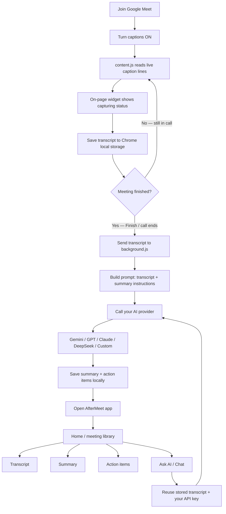
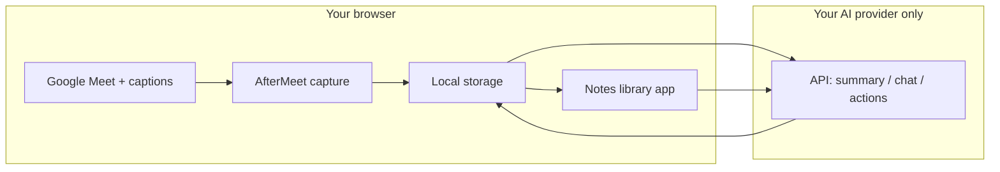

# AfterMeet

[](LICENSE)
[](manifest.json)
[](manifest.json)
[](CONTRIBUTING.md)
[](CODE_OF_CONDUCT.md)

**AfterMeet** is an open-source Chrome extension that captures live captions from **Google Meet**, stores transcripts on your machine, and uses AI (Gemini, GPT, Claude, DeepSeek, or a custom endpoint) to generate summaries, action items, and chat answers.

**Local-first · Bring your own API key · No AfterMeet cloud in the middle**

| | |
|---|---|
| **Version** | 3.5.7 |
| **Platform** | Chrome / Chromium (Manifest V3) |
| **License** | [MIT](LICENSE) |
| **Legal** | [Terms of Use](TERMS.md) · [Privacy Policy](PRIVACY.md) · [Security](SECURITY.md) |

> Feature overview: see **[FEATURES.md](FEATURES.md)**. Want to contribute? Read **[CONTRIBUTING.md](CONTRIBUTING.md)** and our **[Code of Conduct](CODE_OF_CONDUCT.md)**.

---

## How it works


When you start a Google meet AfterMeet gets active and ask you to record the meeting so that you won't end up recording junk meets as well and burn your tockens, Only record the meet when you think its gonna be important and try to speak in English as Google meet it is good at transcribing english more correclty. AfterMeet reads Google Meet’s live captions, saves the transcript locally, and — when you finish a meeting — sends that transcript to **your** AI provider for a summary and action items. You can then browse notes and ask follow-up questions in the app.

Simple end-to-end flow: Meet captions → local transcript → AI → notes you can browse and ask about.



### In plain words

| Step | What happens |
|------|----------------|
| 1 | You join Meet and enable **captions** |
| 2 | The extension **reads caption text** from the page (`content.js`) |
| 3 | Transcript is **stored on your machine** (Chrome local storage) |
| 4 | When you **finish**, the service worker (`background.js`) sends the transcript to **your AI provider** |
| 5 | AI returns a **summary** and **action items**; those are saved locally too |
| 6 | The **app** opens so you can read, chat, search, and manage tasks |
| 7 | Later **Ask AI / Chat** sends the stored transcript (or recent meetings) to the same AI path |




No AfterMeet server sits in the middle: transcripts stay local; AI calls go **directly** from Chrome to the provider you configured.

---

## Table of contents

1. [How it works](#how-it-works)
2. [What you need](#1-what-you-need)
3. [Get the code](#2-get-the-code)
4. [Enable Chrome Developer mode](#3-enable-chrome-developer-mode)
5. [Load the extension](#4-load-the-extension)
6. [Pin the extension](#5-pin-the-extension)
7. [Configure an AI provider](#6-configure-an-ai-provider)
8. [Capture your first meeting](#7-capture-your-first-meeting)
9. [Optional — Google Calendar](#8-optional--google-calendar)
10. [Optional — folder backup](#9-optional--folder-backup)
11. [Using the app day to day](#10-using-the-app-day-to-day)
12. [Update to the latest version](#11-update-to-the-latest-version)
13. [Troubleshooting](#12-troubleshooting)
14. [Project layout](#13-project-layout)
15. [Privacy & data](#14-privacy--data)
16. [Terms of use](#15-terms-of-use)
17. [Contributing](#16-contributing)
18. [Security](#17-security)
19. [License](#18-license)
20. [Acknowledgments](#19-acknowledgments)

---


## 1. What you need

Before you start, make sure you have:

| Requirement | Notes |
|-------------|--------|
| **Google Chrome** (or Chromium) | Manifest V3 support |
| **Git** | To clone this repository |
| **A Google Meet account** | For live caption capture |
| **An AI API key** | At least one of: Gemini, OpenAI, Anthropic, DeepSeek, or a custom OpenAI-compatible endpoint |


---

## 2. Get the code

### Option A — Clone with Git (recommended)

Replace the URL with your fork or the official repo once it is published:

```bash
git clone https://github.com/YOUR_USERNAME/aftermeet.git
```

```bash
cd aftermeet
```

Confirm you are in the extension root (you should see `manifest.json`):

```bash
ls
```

You should see files similar to:

```text
manifest.json
background.js
content.js
popup.html
app/
icons/
README.md
```


### Option B — Download ZIP

1. Open the GitHub repository page.
2. Click **Code → Download ZIP**.
3. Unzip the archive somewhere permanent (for example `~/Projects/aftermeet` or `C:\Users\You\Projects\aftermeet`).

```bash
# macOS / Linux example
unzip aftermeet-main.zip
cd aftermeet-main
```

> Keep this folder. Chrome loads the extension **from this path**. Do not delete or move it without reloading the extension.

---

## 3. Enable Chrome Developer mode

AfterMeet is not (yet) on the Chrome Web Store for everyone — you install it as an **unpacked** extension. That requires Developer mode.

### Steps

1. Open Google Chrome.
2. In the address bar, go to:

   ```text
   chrome://extensions
   ```
or open settings and then click on the extention 


3. In the **top-right** corner, turn **Developer mode** **ON**.


When Developer mode is on, you will see extra buttons such as **Load unpacked**, **Pack extension**, and **Update**.


---

## 4. Load the extension

1. Still on `chrome://extensions`.
2. Click **Load unpacked**.
3. Select the folder that contains **`manifest.json`** (the project root you cloned or unzipped — not a nested `app/` folder).
4. Click **Select** / **Open**.


### Verify it worked

On the AfterMeet card you should see:

- Name: **AfterMeet**
- Version: **3.5.7** (or whatever is in `manifest.json`)
- Toggle: **enabled** (blue / on)


---

## 5. Pin the extension

Pinning keeps AfterMeet one click away.

1. Click the **puzzle piece** (Extensions) icon in the Chrome toolbar.
2. Find **AfterMeet**.
3. Click the **pin** icon so it stays visible.

Click the AfterMeet icon to open the **popup** (status, quick AI settings, **Open app**).


---

## 6. Configure an AI provider

Without an API key, capture still works, but summaries, action items, and Ask AI will not.

### Open Settings

Either:

- Click the extension icon → configure AI in the **popup**, then **Save**, or  
- Click **Open app** → sidebar → **Settings** → **AI / Providers**


### Choose a provider

| Provider | Where to get a key | Default model (approx.) |
|----------|--------------------|-------------------------|
| **Google Gemini** | [Google AI Studio](https://aistudio.google.com/apikey) | `gemini-3.6-flash` |
| **OpenAI (GPT)** | [OpenAI API keys](https://platform.openai.com/api-keys) | `gpt-5.6-terra` |
| **Anthropic Claude** | [Anthropic console](https://console.anthropic.com/settings/keys) | `claude-sonnet-5` |
| **DeepSeek** | [DeepSeek platform](https://platform.deepseek.com/api_keys) | `deepseek-v4-flash` |
| **Custom** | Your own OpenAI-compatible base URL | You set the model name |

### Steps in the UI

1. Select a **provider**.
2. Paste your **API key**.
3. Pick a **model** (or type a custom model name).
4. For **Custom**, also set the **base URL** (for example your local or self-hosted OpenAI-compatible endpoint).
5. Click **Test connection**.
6. Click **Save settings**.

Keys are stored in **Chrome storage on your machine**. This extension does not send them to an AfterMeet server — AI calls go from your browser to the provider you chose.

> Note: `.env.example` is only a reference for developers. The extension reads keys from **Settings / popup**, not from a `.env` file.

```bash
# Optional — peek at the example (does not configure the extension)
cat .env.example
```

---

## 7. Capture your first meeting

### Before the call

1. Make sure AfterMeet is **enabled** on `chrome://extensions`.
2. Join a meeting on:

   ```text
   https://meet.google.com/
   ```

3. Turn **captions** on in Meet (CC). The extension tries to help enable them when possible — if capture is empty, turn captions on manually.


### During the call

- The **content script** listens for caption lines and builds a transcript.
- Use the **on-page widget** for status / finish / export when available.
- Keep the Meet tab open while you want capture to continue.

### After the call

1. **Finish / export** from the widget (or when the call ends) so the meeting is saved.
2. Open the AfterMeet popup → **Open app** (or **Open last meeting**).
3. Open the meeting → check **Transcript**, then **Summary** / **Action items** / **Chat**.


### Tips for better transcripts

- Speak clearly; captions quality depends on Google Meet.
- Prefer the **speaker labels** Meet shows when available.
- You can **rename speakers** later in the participants / talk-share panel.
- You can also **Import** a `.txt` / `.md` / `.json` transcript from the app top bar if you already have one.

---

## 8. Optional — Google Calendar

Connect Calendar to show **Today’s meetings** and **Upcoming (24h)** on Home.

### A. Note your Extension ID and redirect URI

1. Open `chrome://extensions`.
2. Copy AfterMeet’s **ID** (under the extension name).
3. In the app: **Settings → Google Calendar**.
4. Copy the **Authorized redirect URI** shown there. It looks like:

   ```text
   https://<YOUR_EXTENSION_ID>.chromiumapp.org/
   ```

### B. Create OAuth credentials in Google Cloud

1. Open [Google Cloud Console → Credentials](https://console.cloud.google.com/apis/credentials) (create a project if needed).
2. Enable the [Google Calendar API](https://console.cloud.google.com/apis/library/calendar-json.googleapis.com).
3. Configure the [OAuth consent screen](https://console.cloud.google.com/apis/credentials/consent):
   - User type: **External**
   - Add your Google email as a **test user**
4. **Create credentials → OAuth client ID → Application type: Web application**.
5. Under **Authorized redirect URIs**, paste the exact URI from Settings (step A).
6. Copy the **Client ID** (ends with `.apps.googleusercontent.com`).

### C. Connect inside AfterMeet

1. Paste the Client ID into **Settings → Google Calendar**.
2. Click **Save Client ID**.
3. Click **Connect account** and finish the Google sign-in prompt.


Home should now show calendar cards under **Today’s meetings** / **Upcoming (24h)**.

---

## 9. Optional — folder backup

Meetings live in Chrome local storage by default. You can also:

- **Export** a full JSON backup from the app (API keys are stripped).
- Link a **backup folder** in Settings (File System Access) so JSON copies can be written to a folder you choose.

Recommended:

1. Settings → Privacy / backup section.
2. Choose a folder you control (for example `~/Documents/AfterMeet-backups`).
3. Periodically export or confirm backups after important meetings.

---

## 10. Using the app day to day

### Surfaces

| Surface | What it’s for |
|---------|----------------|
| **Toolbar popup** | Recording status, theme, open library, quick AI keys, last meeting |
| **Notes library (`app/`)** | Home, meetings, tasks, people, Ask AI, Settings |
| **On-page Meet widget** | Live capture during a call |

### Sidebar navigation

- **Home** — greeting, stats, today / upcoming, recent meetings table  
- **All meetings** — full library grid  
- **My Tasks** — action items across meetings  
- **People** — participant insights  
- **Favorites** — starred meetings  
- **Search** — find meetings  
- **Ask AI** — ask across recent meetings  
- **Settings** — AI, Calendar, privacy, theme  

Click the **AfterMeet** brand in the sidebar to return **Home**.

### Inside a meeting

Tabs typically include:

- **Chat** — ask about this meeting  
- **Transcript** — full caption text  
- **Summary** — AI summary  
- **Action items** — tasks with owner / deadline / priority  
- **Highlights** — saved moments  

Right panel: details, participants / talk share, labels, share brief.

### Useful keyboard shortcuts

| Shortcut | Action |
|----------|--------|
| `⌘/Ctrl + K` | Quick search |
| `⌥ + J` | Ask AI / chat |
| `⌥ + T` | Transcript |
| `⌥ + S` | Summary |
| `⌘/Ctrl + 1–5` | Meeting tabs |
| `⌘/Ctrl + N` | New notes |
| `⌘/Ctrl + ,` | Settings |
| `⌘/Ctrl + .` | Details panel |
| `⌘/Ctrl + \` | Focus mode |

---

## 11. Update to the latest version

When the repo gets new commits:

```bash
cd aftermeet
```

```bash
git pull
```

Then in Chrome:

1. Open `chrome://extensions`.
2. Click **Reload** on the AfterMeet card.
3. Close any open AfterMeet **app** tabs.
4. Open the app again from the popup so scripts refresh.

If something looks broken after an update:

```bash
git status
git log -1 --oneline
```

Confirm you pulled the intended commit, then reload the extension again.

---

## 12. Troubleshooting

| Problem | What to try |
|---------|-------------|
| **Load unpacked fails** | Select the folder that contains `manifest.json`, not `app/` |
| **Extension missing after restart** | Folder was moved/deleted — restore path or Load unpacked again |
| **Captions not captured** | Reload the Meet tab; turn CC on; reload the extension; stay on `meet.google.com` |
| **Empty or short transcript** | Captions were off or Meet didn’t show CC lines — check Meet caption language |
| **AI errors / Test connection fails** | Check key, model name, billing on the provider, and network; try another model |
| **App UI looks stale** | Close all `app/app.html` tabs, reload extension, open app again |
| **Calendar connect fails** | Redirect URI must match **exactly**; Extension ID changes if you remove + re-add unpacked; add yourself as OAuth test user |
| **Permission prompts** | Allow Meet / identity prompts; for custom HTTP endpoints, grant optional host access when Chrome asks |

### Developer checks

```bash
# Confirm you are in the extension root
pwd
ls manifest.json
```

```bash
# Confirm Manifest V3 name/version
grep -E '"name"|"version"|"manifest_version"' manifest.json
```

---

## 13. Project layout

```text
aftermeet/
├── manifest.json          # MV3 config, permissions, content scripts
├── background.js          # Service worker (summary, AI jobs)
├── content.js             # Google Meet caption capture
├── content.css            # On-page widget styles
├── popup.html / popup.js  # Toolbar popup
├── options.html / options.js
├── icons/                 # Extension icons
├── docs/
│   └── screenshots/       # README images (add your PNGs here)
├── .github/               # CODEOWNERS, issue & PR templates
├── LICENSE                # MIT
├── TERMS.md               # Terms of Use
├── PRIVACY.md             # Privacy Policy
├── SECURITY.md            # Vulnerability reporting
├── CODE_OF_CONDUCT.md     # Contributor Covenant
├── CONTRIBUTING.md        # How to contribute
├── FEATURES.md            # Product feature list
├── .env.example           # Dev reference only (not read by the extension)
└── app/                   # Full notes library UI
    ├── app.html / app.js / app.css
    ├── styles/            # Split CSS modules
    ├── theme.css / theme.js
    ├── views/
    ├── services/
    ├── shell/
    └── core/
```

No build step is required for normal use — load the folder as an unpacked extension.

---

## 14. Privacy & data

**Full policy:** [PRIVACY.md](PRIVACY.md)

In short:

- Transcripts and meeting metadata are stored **locally** in Chrome (`storage` + `unlimitedStorage`).
- Optional **folder backup** writes JSON copies to a folder **you** choose.
- AI calls go **directly** from your browser to the provider you configured — not through an AfterMeet server.
- Calendar OAuth tokens stay in local storage; Calendar API is used only when you connect it.
- Mark meetings **private** to hide them from the home overview if you prefer.
- JSON exports strip API keys for safety.
- You are responsible for consent and compliance when capturing meetings in your jurisdiction.

---

## 15. Terms of use

By installing or using AfterMeet you agree to the **[Terms of Use](TERMS.md)**.

Highlights:

- Software is provided **as is** under the MIT License
- You must follow applicable recording / privacy laws and third-party terms (Google, AI providers)
- You bring and pay for your own API keys
- AI output is not professional advice — verify important decisions yourself

---

## 16. Contributing

Contributions are welcome.

Please read:

- **[CONTRIBUTING.md](CONTRIBUTING.md)** — branch workflow, PR checklist  
- **[CODE_OF_CONDUCT.md](CODE_OF_CONDUCT.md)** — community standards  

**`main` is protected.** Do not push commits directly to `main`. Work on a branch and open a **pull request**.

Code review owners are listed in [`.github/CODEOWNERS`](.github/CODEOWNERS) (replace `@YOUR_GITHUB_USERNAME` with your real handle).

### Short path

```bash
git clone https://github.com/YOUR_USERNAME/aftermeet.git
cd aftermeet
git checkout -b feature/your-change
```

1. Make your changes.
2. Load / reload the unpacked extension and test on a Meet call.
3. Commit and push the **feature branch** (not `main`).
4. Open a pull request into `main` and wait for review.

```bash
git add .
git status
git commit -m "Describe why this change helps users"
git push -u origin feature/your-change
```

Please keep PRs focused. Prefer small, reviewable changes over large unrelated refactors. Never commit API keys or real meeting transcripts.

### Maintainers — lock down `main`

On GitHub: **Settings → Branches → Add branch ruleset** for `main`, then enable:

- Require a pull request before merging  
- Require at least **1** approval  
- Require review from **Code Owners**  
- Block force pushes and restrict deletions  

Details: [CONTRIBUTING.md](CONTRIBUTING.md#maintainer-checklist-protect-main).

---

## 17. Security

Found a vulnerability? **Do not** open a public issue.

See **[SECURITY.md](SECURITY.md)** for supported versions and how to report privately (GitHub Security Advisories preferred).

---

## 18. License

This project is licensed under the **MIT License** — see the [LICENSE](LICENSE) file for the full text.

```text
Copyright (c) 2024–2026 AfterMeet contributors
```

You may use, copy, modify, merge, publish, distribute, sublicense, and sell copies of the Software, subject to including the copyright and permission notice. The Software is provided **without warranty**.

---

## 19. Acknowledgments

- Built for people who want meeting notes that stay on their machine
- Relies on Google Meet captions and the AI providers you choose
- Thanks to everyone who files issues, improves docs, and sends pull requests

---

## Quick start (cheat sheet)

```bash
git clone https://github.com/YOUR_USERNAME/aftermeet.git
cd aftermeet
```

1. Chrome → `chrome://extensions` → **Developer mode ON**  
2. **Load unpacked** → select this folder  
3. Pin AfterMeet → open popup → set **AI key** → **Test** → **Save**  
4. Join Meet → turn **captions** on → finish meeting → **Open app**

You’re ready. Review [TERMS.md](TERMS.md) and [PRIVACY.md](PRIVACY.md) before using AfterMeet with real meetings.
